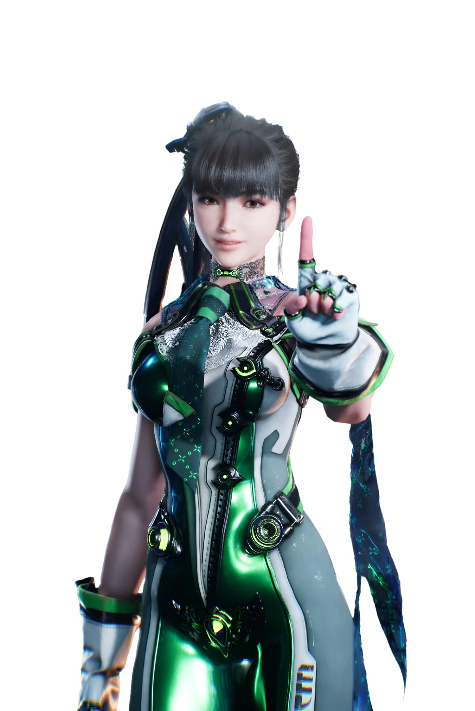

<div align="center">
    <a href="https://github.com/kawarimidoll/typograssy">
        
    </a>
    <p>
        
        </a>
    </p>
</div>
<br> <div align="center">
    
</div>

<h2 align="center"> 👁️‍🗨️ About me 👁️‍🗨️ </h2>

```zsh
MotherSphere@Colony $ neofetch
```
<table>
  <tr>
    <!-- LEFT column: images stacked vertically -->
    <td valign="top" align="center">
      <a href="https://discord.com/users/503306069884534796">
        
      </a>
      <br><br>
      <a href="https://github.com/kittinan/spotify-github-profile">
        
      </a>
    </td>
<!-- RIGHT column: C# block -->
<td valign="top">
<pre><code class="language-csharp">●▬▬▬▬▬▬▬▬▬▬▬▬▬▬▬▬▬▬▬▬▬▬▬▬▬▬▬▬▬▬▬▬▬▬▬▬▬▬▬▬▬▬▬●
░░░░░░░░░░░░░░░░░░░░░░░░░░░░░░░░░░░░░░░░░░░░░░░░░░░░░░░░░░░░░░░
░░░░░░░░░░░░░░█░█░█░█▀▀▀░█░░░░█▀▀▀░█▀▀█░█▀█▀█░█▀▀▀░░░░░░░░░░░░░
░░░░░░░░░░░░░░█░█░█░█▀▀▀░█░░░░█░░░░█░░█░█░█░█░█▀▀▀░░░░░░░░░░░░░
░░░░░░░░░░░░░░▀▀▀▀▀░▀▀▀▀░▀▀▀▀░▀▀▀▀░▀▀▀▀░▀░▀░▀░▀▀▀▀░░░░░░░░░░░░░
░░░░░░░░░░░░░░░░░░░░░░░░░░░░░░░░░░░░░░░░░░░░░░░░░░░░░░░░░░░░░░░
●▬▬▬▬▬▬▬▬▬▬▬▬▬▬▬▬▬▬▬▬▬▬▬▬▬▬▬▬▬▬▬▬▬▬▬▬▬▬▬▬▬▬▬●

╔══════════════════════════════════════════════╗
║ PLAYER CARD
║
╠► Name : Lin Ha Zahard
╠► Age : 27*
╠► Nationality : Belgian with a sprinkle of chinese
╠► Language : French, English
╠► Favourite Games : Stellar Blade, Mount And Blades Warband, Rust, Assassin's creed, CS:GO
╠► Favourite Mods : All
╠► Skype : ✔
╠► Mumble : ✗
╠► TeamSpeak : ✗
╠► Discord : ✔
╠► Player : [PC]✓[XBOX]✓ [PS4] ✓
╚══════════════════════════════════════════════╝

▂▃▄▅▆▇█▓▒░ PC Components ░▒▓█▇▆▅▄▃▂

╔═►OS : Windows 11 - 64 Bits
╠═►MotherBoard : Asus ROG Crosshair VIII Formula
╠═►Processor : Ryzen 9 3900X - 3.8Ghz
╠═►RAM : Corsair Dominator Platinum RGB 32Go
╠═►Hard Disque : Samsung SSD 970 EVO M.2 PCIe NVMe 1 To
╠═►GC : ASUS GeForce RTX 2080 SUPER O8G
╠═►Monitor : MSI 31.5" LED - Optix MAG321CQR / Acer Predator GN246HLBbid
╠═►KeyBoard : Razer Huntsman Elite
╠═►Mouse : Razer Viper 8k
╚═►headset : Razer Kraken Tournament

▂▃▄▅▆▇█▓▒░ PC Components (Second)░▒▓█▇▆▅▄▃▂

╔═►OS : Windows 7 - 2017
╠═►MotherBoard : Sabertooth 990FX R3.0
╠═►Processor : FX-9590 Black Edition - 4.74Ghz (new edition)
╠═►RAM : HyperX Fury - HX318C10FBK2 - 8x2 (16go)
╠═►SSD : SSD 120 go Samsung
╠═►Hard Disque : Samsung 2T
╠═►GC : Asus ROG STRIX-GTX1060-O6G-GAMING
╠═►KeyBoard : Corsair Strafe MX Red Switch
╠►Mouse : Mionix Castor Gaming Mouse
╠►Second Mouse : Sky digital Nmouse 4K Real 4K
╚►Headset : Roccat Kulo
</code></pre>
    </td>
  </tr>
</table>
<div>
    <br>
    <br>
    <br>
    <br>
    <p align="right">
        <a href = "https://youtu.be/LrsJSds358Q?list=RDLrsJSds358Q">
            
        </a>
        <b>“May your memories live on, Forever”</b>
    </p>
    <br>
    <br>
    <p align="left">
        <a href = "https://www.youtube.com/watch?v=oXlEEXws3gc">
            
        </a>
        <b><br><br>高橋李依🎶「共感されなくてもいいじゃない」。🎶🆙</b>
    </p>
    <br>
    <br>
    <p align="right">
        <a href="https://www.youtube.com/watch?v=jC97suFyObw">
            
        </a>
        <b><br>雨宮天🎶「ロンリーナイト・ディスコティック」。🎶💌</b></p>
    <br>
    <br>
    <p align="left">
    <a href="https://youtu.be/b_cuMcDWwsI?si=uaO4V3vYFIG26hrr">
        
    </a>
    <b><br>wowaka 『裏表ラバーズ』feat. 初音ミク。💘🪄💕</b>
    </p>
</div>

<br>
<br>
<br>

<div>
    <h2 align="center"> 🔎Knowledge📖 </h2>
</div>
<div align = "center">
    <p align = "justify">
        Behold ! My skills :
        <br>
    </p>
    <p align = "center">
         <a href="https://skillicons.dev">
             
        </a>
    </p>
</div>
<h2 align = "center"> 📉 GitHub Stats</h2>
<div> 
    <p align = "center">
        <a href="https://github-readme-stats.vercel.app">
            
        </a>
        <a href="https://github-readme-streak-stats.herokuapp.com">
            
        </a><!--change language to japanese locale=jp-->
        <a href="https://github.com/ryo-ma/github-profile-trophy">
            
            
        </a>
        <a href="https://github.com/ashutosh00710/github-readme-activity-graph">
            
        </a>
        <a href="https://github.com/vn7n24fzkq/github-profile-summary-cards">
            
    </p>
</div>
<h2 align ="center"> 📝 Contact me 📝</h2>
<div align="center">
    <a href="https://github.com/mothersphere" target="_blank">
        
    </a>
    <br>
    <br>
    
    
</div>  
<br>
<div>
    <h2 align="center">Thank you for reading 🙋🏻‍♂️</h2>
    <div align="center">
        
    </div>
</div>
<br> 
<br>
